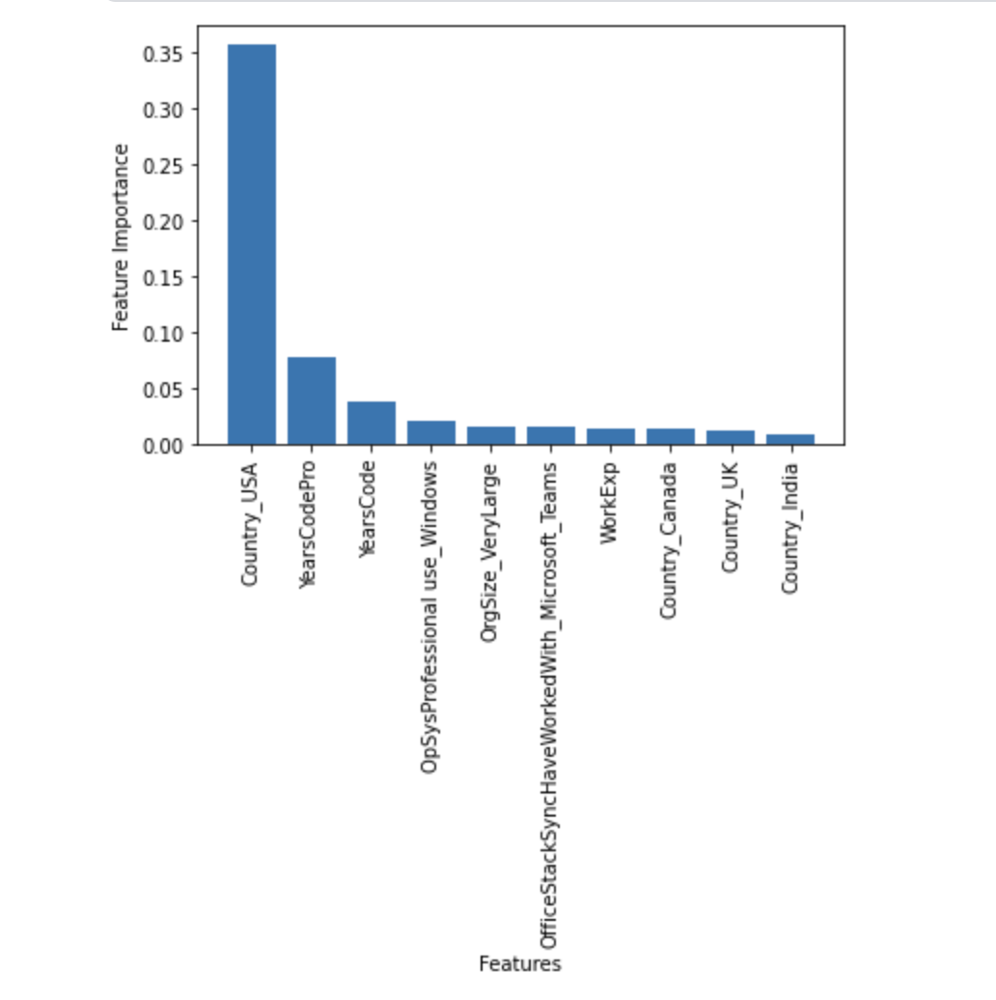
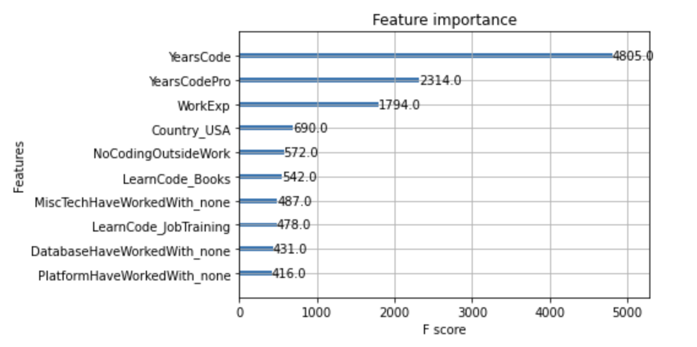
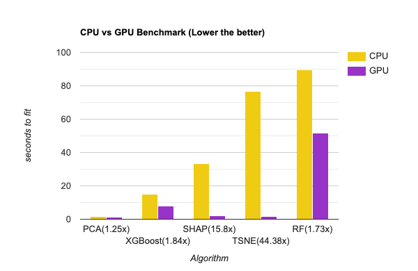

# SoMAD: Stack Overflow Mining and Analytics of Developer Data


## Contents
1. [Introduction](#introduction)
2. [Problem Definition](#problem-definition)
3. [Dataset](#dataset)
4. [Exploratory Data Analysis](#exploratory-data-analysis)
5. [Data Cleaning and Preprocessing](#data-cleaning-and-preprocessing)
    - [Handling Missing Values](#1-handling-missing-values)
    - [Renaming/Rescaling Columns](#2-renaming-rescaling-columns)
    - [Handling multi-categorical data](#3-handling-multi-categorical-data)
    - [Removing Outliers](#4-removing-outliers)
6. [Feature Engineering](#feature-engineering)
7. [Methodology](#methodology)
    - [Unsupervised](#unsupervised)
    - [Supervised](#supervised)
    - [Hyperparameter Tuning](#hyperparameter-tuning)
8. [Metrics](#metrics)
9. [Tabulation of results](#result-tabulation)
10. [Feature Explainability](#feature-explainability)
11. [GPU Acceleration](#gpu-acceleration)
12. [Conclusion and Discussion](#conclusion-and-discussion)
13. [Contribution Table](#contribution-table)
14. [Gantt Chart](#gantt-chart)
15. [References](#references)

## Introduction
[🔝](#contents)


With technological advancement and ever-evolving research in computer science, understanding developer compensation has become highly complicated and contingent on multiple factors[3]. There have been numerous studies on this [4][5], and yet it is difficult for a developer to gauge the compensation for a specific position[6]. Numerous articles try to resolve this by handling questions related to compensation [7] rather than clarifying what the expectation should be. Research also states that getting a lesser salary than your peers can affect an individual's job satisfaction[8]. We aim to provide quantifiable data regarding compensation for software developers with respect to factors that affect compensation through this work. We would be using the features from the stack overflow survey in order to predict the compensation of a developer. After data cleaning and preprocessing, we are left with 8392 examples and we shall use both supervised and unsupervised methods in order to obtain our prediction.

---

## Problem Definition
[🔝](#contents)

> We aim to distill and explain the effect of various software technologies, work environments, and other factors on developer compensation. We shall use this information to perform predictions of future trends. Additionally, we analyze model performance end-to-end on GPUs using the RAPIDS library [11][12] and benchmark the performance with scikit-learn.

<details> <summary> <b> 💡 Click to view Detailed objectives </b> </summary>

- Perform Feature Engineering on the dataset to identify and rank features before model fitting and later assess their shapley interactions[10] within each other after model fitting.
- Use multiple supervised approaches based on the data modalities to quantify and predict developer compensation.
- Use unsupervised approaches to explore the statistical nature of the dataset.
- Analyze the trends over the past three years surveys to predict the future interactions
- Explain and rank the factors affecting salaries using ML explainability algorithms and metrics.
- Mine insights from the survey data and draw inferences that might help developers make the right decisions with respect to their careers and choices of technologies.

</details>

---

## Dataset
[🔝](#contents)

Our Dataset is the [Stackoverflow Developer Survey 2022](https://info.stackoverflowsolutions.com/rs/719-EMH-566/images/stack-overflow-developer-survey-2022.zip) Dataset [1]. We also plan to extend to use the [2021](https://info.stackoverflowsolutions.com/rs/719-EMH-566/images/stack-overflow-developer-survey-2021.zip)[8] and [2020](https://info.stackoverflowsolutions.com/rs/719-EMH-566/images/stack-overflow-developer-survey-2020.zip) datasets [9] for time-series analysis and prediction for 2023.


### 🗃 Dataset schema for 2022 Developer Survey Dataset

- `79` columns, `73268` rows
- <details> <summary> <b> Click to view Features and their datatypes </b> </summary>

    | type | feature |
    | --------- | ------ |
    | int | ResponseId |
    | float | WorkExp |
    | float | CompTotal |
    | float | VCHostingPersonal use |
    | float | VCHostingProfessional use |
    | float | ConvertedCompYearly |
    | string | MainBranch |
    | string | Employment |
    | string | RemoteWork |
    | string | CodingActivities |
    | string | EdLevel |
    | string | LearnCode |
    | string | LearnCodeOnline |
    | string | LearnCodeCoursesCert |
    | string | YearsCode |
    | string | YearsCodePro |
    | string | DevType |
    | string | OrgSize |
    | string | PurchaseInfluence |
    | string | BuyNewTool |
    | string | Country |
    | string | Currency |
    | string | CompFreq |
    | string | LanguageHaveWorkedWith |
    | string | LanguageWantToWorkWith |
    | string | DatabaseHaveWorkedWith |
    | string | DatabaseWantToWorkWith |
    | string | PlatformHaveWorkedWith |
    | string | PlatformWantToWorkWith |
    | string | WebframeHaveWorkedWith |
    | string | WebframeWantToWorkWith |
    | string | MiscTechHaveWorkedWith |
    | string | MiscTechWantToWorkWith |
    | string | ToolsTechHaveWorkedWith |
    | string | ToolsTechWantToWorkWith |
    | string | NEWCollabToolsHaveWorkedWith |
    | string | NEWCollabToolsWantToWorkWith |
    | string | use |
    | string | use |
    | string | VersionControlSystem |
    | string | VCInteraction |
    | string | OfficeStackAsyncHaveWorkedWith |
    | string | OfficeStackAsyncWantToWorkWith |
    | string | OfficeStackSyncHaveWorkedWith |
    | string | OfficeStackSyncWantToWorkWith |
    | string | Blockchain |
    | string | NEWSOSites |
    | string | SOVisitFreq |
    | string | SOAccount |
    | string | SOPartFreq |
    | string | SOComm |
    | string | Age |
    | string | Gender |
    | string | Trans |
    | string | Sexuality |
    | string | Ethnicity |
    | string | Accessibility |
    | string | MentalHealth |
    | string | TBranch |
    | string | ICorPM |
    | string | Knowledge_1 |
    | string | Knowledge_2 |
    | string | Knowledge_3 |
    | string | Knowledge_4 |
    | string | Knowledge_5 |
    | string | Knowledge_6 |
    | string | Knowledge_7 |
    | string | Frequency_1 |
    | string | Frequency_2 |
    | string | Frequency_3 |
    | string | TimeSearching |
    | string | TimeAnswering |
    | string | Onboarding |
    | string | ProfessionalTech |
    | string | TrueFalse_1 |
    | string | TrueFalse_2 |
    | string | TrueFalse_3 |
    | string | SurveyLength |
    | string | SurveyEase |
    </details>

## Exploratory Data Analysis
[🔝](#contents)
> The Survey was conducted recently on May 2022 over 70,000 developers/software industry professionals

- 🤓 **Developer Profile / Respondent's profile**

    1. Education: Most developers have an (87%) have a post-secondary education[1]

        


    2. **Learning to code:** Older ones (45 and above) likely to have learned to code from books, younger ones (under 18) rely on online courses/certifications.[1]

        

    3. **years of coding in total:** 50% of respondents have been coding 10 years or less[1]

        

    4. **coding as part of work/profession:** about 75% have coded professionally for fewer than 14 years[1]

        

    5. **Developer Type:** Full-stack, back-end, and front-end are the most common. Many reports wearing multiple developer-type hats.[1]

        

    6. **Demographic:** 46% of Professional Developers are 25-34 years old.[1]

        

-  💻 **Technology: Tools and technologies developers are currently using and their popularity**

    1. **programming languages:** Javascript is the most widely used overall.

        
    2. **databases:** MySQL and PostgreSQL most popular
    3. **web frameworks and technologies:** Node.js and React.js are clearly the most popular.
    4. **cloud platform:** Among professionals, AWS remains the most used, followed by Azure and GCP. Among those learning to code, Heroku is the most popular.
    5. **Machine Learning:** Tensorflow is the most popular, followed by sklearn and then pytorch.
    6. **Synchronous tools:** Zoom, Microsoft Teams, and Slack are the most popular
- 💼 **Work: Respondent's employment, company info, influence, hobby etc.**

    1. **Employment status:** Employed full-time, student, freelancer, part-time, retired.
    2. **geography:** where they work: remote, hybrid, in-person
    3. **company size:** ballpark number of employees in the company the developer works for.
    4. **years of professional experience:** 54% of respondents are in their first 10 years of experience.
    5. **Independent contributor vs people's manager:** 84% of surveyed are Independent contributors
- 🤑 **Salary Distribution**

    In order to explore the data, a good first step would understand the distribution of our target variable, `ConvertedCompYearly`. We then use an automatic histogram binning method to understand the salary distribution. We perform log transformation on the salary data in order to ensure that residual variance does not increase with a salary increase. We also try the square root transformation to better understand the data distribution. The plots for the same are presented below.

    

    

    


    - <b> Compensation by Country </b> : We now take a look at the analysis of compensation by country. We see that the top 6 countries with the most responses are United Kingdom of Great Britain and Northern Ireland, United States of America, Canada, Germany, France and India. From the graphs obtained, it is clear that most of the highest earners are located in the US and Europe.

        

    - <b> Compensation by Developer Experience </b> : We also perform an analysis of understanding how salary is affected by years of developer experience. We observe an increase in the salary with an increase in the number of years of experience as well, and this is expected.

        

    - <b> Compensation by Education Level </b> : We then perform an analysis of the change in salary with the level of education obtained. We can see that with an increase in education level, the distribution skews towards the right indicating the median salary does increase with an increase in education level. This shows that level of education may play a factor in determining developer compensation.

        

    - <b> Compensation By Languages Known </b> : We also observe an increase in the average salary as the developer learns more languages. This is expected as the more languages a developer knows, the more valuable they are to the company.

        

    - <b> The effect of blockchain </b> : Blockchain was a hot topic and new technology currently. Thus, the survey also asks for developers' opinions about blockchain. We can see that people with an unfavorable opinion of blockchain seem to be earning more. This may be because more experienced and seasoned developers have not bought into blockchain hype.

        
---

## Data Cleaning and Preprocessing
[🔝](#contents)

Broadly, the following steps were performed make the data structured:
1. Handling missing values
2. Renaming/Rescaling column values
3. Handling multi-categorical data
4. Removing outliers

### 1. Handling Missing Values
[🔝](#contents)

- As with large data sources, we had a lot of null-values that had to be handled. On average about 50% of data was missing in each column as we can see in the below image. It shows the percentage of missing values (`nan`) in each column sorted in descending order (top 30).

    

    We can immediately see that columns `"VCHostingProfessionalUse"` and `"VCHostingPersonalUse"` can be dropped.

- We used different strategies to handle the missing values based on the importance of the feature, type (categorical or numerical) and the amount of missing values:
    - If the column had more than 50% missing values, we dropped the column. Around 60% (48 of 79) of sparse, uninformative columns were dropped as a result.
    - For some columns like "RemoteWork', 'EdLevel', 'TBranch', 'ICorPM', 'DevType" we filled the missing values with `none` so that string manipulation modules like `Series.str.contains()` do not throw an error
    - For numerical columns like "YearsCode', 'YearsCodePro', 'WorkExp", we filled the missing values with the median of the column
    - For "Age" column, we filled the missing values with the mean value of each gender.

### 2. Renaming/Rescaling columns
[🔝](#contents)
**2.1 Rescaling columns**
- To avoid an imbalance in absolute values, we rescaled the column for converted annual compensation (`ConvertedCompYearly`) in `kUSD/year` by dividing by 1000.

**2.2 Renaming columns**
- We renamed the multiple categorical labels in each column from long, verbose strings to single words. This was primarily for easy tokenization for encoding into multi-hot vectors.
A Sample snippet where we simultaneously do the renaming of columns as well as handling nans for the column "OrgSize" (the organization size of the company that they work for)

    ```python
    df['OrgSize'] = df['OrgSize'].fillna("None").replace({"10,000 or more employees": "VeryLarge",
                                      "20 to 99 employees": "Small",
                                      "100 to 499 employees": "Medium",
                                      "1,000 to 4,999 employees": "Large",
                                      "5,000 to 9,999 employees": "VeryLarge",
                                      "2 to 9 employees": "VerySmall",
                                      "10 to 19 employees": "VerySmall",
                                      "500 to 999 employees": "Medium",
                                      "Just me - I am a freelancer, sole proprietor, etc.": "VerySmall",
                                      "I don't know": "None",
                                      "I prefer not to answer": "None"})
    ```

### 3. Handling multi-categorical data
[🔝](#contents)
- A lot of the meaningful columns have data in the form of multiple categorical labels. For example, the column "DevType" has data like "Back-end developer;Front-end developer;Full-stack developer". The standard method for handling such information is to 'sparsify' them into multiple columns using one-hot encoding. The different categorical labels were separated and fed into a `CountVectorizer` to tokenize. For each of the tokens, a one-hot encoded column is created.
A sample reusable snippet for handling multi-categorical data:

    ```python
    def preprocess_multicategorical(df, col='PlatformHaveWorkedWith'):
        # fill nan values with 'None', and split the string by ';'
        list_of_multicategorical = df[col].fillna('none').str.split(';').to_list()
        list_to_tokenize = []
        for item in list_of_multicategorical:
            if item != ['none']:
                str = []
                # for each category for that row
                for i in item:
                    for c in ' #-./+():':
                        # replace special characters with '_'
                        i = i.replace(c, '_')
                    str.append(i)
                # join the categories by space to make a string for every row
                str = ' '.join(str)
            else:
                str = 'none'
            # feed into the list to tokenize
            list_to_tokenize.append(str)
        vectorizer = CountVectorizer(lowercase=False)
        vectorizer.fit(list_to_tokenize)
        # obtain the vocabulary from the tokenized list
        voc = vectorizer.vocabulary_
        # voc.items() gives (key, value) as (category_token, index)
        voc_inv = {v: col+'_'+k for k, v in voc.items()}
        # transform the list of strings into a sparse, one-hot encoded matrix
        vector = vectorizer.transform(list_to_tokenize)
        # convert to dataframe
        cols_to_add = pd.DataFrame(vector.toarray())
        cols_to_add = cols_to_add.rename(columns=voc_inv)
        # concatenate across axis=1 and drop the original column
        df = pd.concat([df,cols_to_add], axis=1).drop([col], axis=1)
        return df
    ```
    - The above snippet can be used to handle any multi-categorical column. The only thing that needs to be changed is the column name in the function call.

### 4. Removing outliers
[🔝](#contents)

- We removed the 5% of smallest and 5% of largest salaries. Namely, `df[df.ConvertedCompYearly < 1000 and df.ConvertedCompYearly > 500000]` were removed. This was done to avoid skewing the data towards the extremes.
- Since the responders were extremely skewed in US, as well as the fact that most were Developers (full-stack/back-end), we filtered outliers based on the developer profession and country of the respondent.
    - We only select Developer professions that atleast got 200 responses.

        ```
            Developer, full-stack                            4992
            Developer, back-end                              3817
            Developer, front-end                             1546
            Developer, mobile                                1009
            Developer, desktop or enterprise applications     505
            Other (please specify):                           443
            Developer, embedded applications or devices       438
            Data scientist or machine learning specialist     342
            Engineering manager                               279
            Engineer, data                                    217
        ```
    - Similarly, filter the countries also by the response, and include only those that got atleast 200 responses

        ```
            USA                   3103
            UK                    1117
            India                  950
            Germany                865
            Canada                 548
            Brazil                 512
            France                 435
            Poland                 392
            Spain                  370
            Netherlands            309
            Australia              269
            Italy                  256
            Russian Federation     201
            Name: Country, dtype: int64
        ```

---

## Feature Engineering
[🔝](#contents)

Feature selection is the process of reducing the number of input variables/features when developing a predictive model. It is often desirable to reduce the number of features to both reduce the computational cost of modeling and, in some cases, to improve the performance of the model.

<b> Forward Feature Selection: </b>
The Forward Feature Selector adds features to form a feature subset in a greedy fashion. It starts with zero features, and at each stage, this selector chooses the best feature to add based on the predictive performance of a model (or estimator). We used Linear Regression as our estimator.

```python
from sklearn.feature_selection import SequentialFeatureSelector
from sklearn.linear_model import LinearRegression
# Perform forward feature selection
lr = LinearRegression()
sfs = SequentialFeatureSelector(lr, n_features_to_select=10)
sfs.fit(X, y)
selected_features_mask = sfs.get_support()
X.loc[:, selected_features_mask].columns
```
The top 3 most important features identified by the Forward Feature Selector are: `YearsCode`, `OpSysProfessional use_macOS`, `Country_USA`.


<b> Backward Feature Selection: </b>

The Backward Feature Selector removes features to form a feature subset in a greedy fashion. It starts with all the features, and at each stage, this selector chooses the best feature to removed based on the predictive performance of a model (or estimator). As compared to Forward Feature Selection, the Backward Feature selection is often much more slower and computationally expensive. Again, we used Linear Regression as our estimator.

```python
from sklearn.feature_selection import SequentialFeatureSelector
from sklearn.linear_model import LinearRegression

# Perform forward feature selection
lr = LinearRegression()
sfs = SequentialFeatureSelector(lr, n_features_to_select=10, direction='backward')
sfs.fit(X, y)
selected_features_mask = sfs.get_support()
X.loc[:, selected_features_mask].columns
```

The top 3 most important features identified by the Backward Feature Selector are: `MainBranch_Developer`, `YearsCode`, `ICorPM_People_manager`.

<b> Recursive Feature Elimination with Cross Validation: </b>
We perform recursive feature elimination using cross-validation in order to find the optimum number of features to consider in order to predict developer compensation. Recursive feature elimination is a feature selection method that works on the principle of backward selection and thus removes features until we reach a specified number of features. In order to find the optimal number of features, RFECV uses cross-validation in order to score different features and thus select the best-scoring features, which can then be used for modeling purposes. We also obtained a plot regarding the change in cross-validated score with the number of features which is shown below.

```python
from sklearn.feature_selection import RFECV
selector = RFECV(DecisionTreeRegressor(), step=1, cv=3)
selector = selector.fit(X_all_OH, y)

plt.ylabel('model accuracy')
plt.xlabel('features selected')
plt.plot(range(1, len(selector.grid_scores_)+1), selector.grid_scores_)
plt.legend()
plt.show()
```


## Methodology
[🔝](#contents)

The dataset comprises 73267 examples and 78 features. Only 38071 examples have a Y label (`ConvertedCompYearly`) that we are trying to predict and we would need to disregard the remaining examples. After Data Cleaning and Preprocessing step, we are left with 8392 examples. In this work, we shall use the features from the stack overflow survey in order to predict the compensation of a developer. We shall use both supervised and unsupervised methods in order to obtain our prediction.

### Unsupervised
[🔝](#contents)
Unsupervised learning uses machine learning algorithms to analyze and learn patterns from unlabelled data. These algorithms are able to discover hidden patterns or data groupings without the need for human intervention. We explore 2 unsupervised ML algorithms

<b>1.1 Principal Component Analysis (PCA) [14] </b> While more data features generally yield better-performing models, but it can sometimes negatively affect the performance of machine learning models (i.e. overfitting) and can make it harder to visualize the dataset. PCA is a type of dimensionality reduction technique which is used to reduce redundancies and to compress datasets through feature extraction. It projects the data into lower dimensional space while preserving maximum information (i.e. variance). Since all the categorical features in our dataset are represented with one-hot and multi-hot encodings, it lead to generation of high dimensional sparse feature vectors. We use PCA to reduce the dimensionality of these sparse high-dimensional feature vectors.

In order to better visualize the data, we project the dataset into 2D space using PCA.

```python
from sklearn.decomposition import PCA
pca = PCA(n_components=2)
# PCA applied to StackOverflow Developer Survey Dataset
X_pca = pca.fit(X).transform(X)
# Create a scatter plot of X_pca (2D). Colorbar shows the yearly compensation in k$.
plt.figure(figsize=(8, 6), dpi=100)
plt.scatter(X_pca[:, 0], X_pca[:, 1], c=np.clip(y, 0, 200), s=10, cmap='YlOrRd')
plt.legend(loc="best", shadow=False, scatterpoints=1)
plt.title("PCA of Stackoverflow dataset")
plt.colorbar().set_label('k$/y', rotation=270, loc='center')
```


The x-axis and y-axis are the first and second principal component directions, respectively. The color bar represents the yearly compensation in thousand $ per year. For the purpose of visualization, we clipped the yearly compensation in range 0-200. From the PCA scatterplot, we observe that for Feature 1 values < 0 and Feature 2 values between -10 to 10, the yearly compensation is on the lower side.

In order to perform our prediction, we see that <b>151</b> PCA components explain 99% of the variance in the dataset. We thus use these 151 components as our features for prediction.

<b>1.2 t-distributed Stochastic Neighbor Embedding (t-SNE) [22] </b> t-SNE is a statistical method for visualizing high-dimensional data by giving each datapoint a location in a two or three-dimensional space.

Again, in order to better visualize the data, we project the dataset into 2D space using t-SNE.

```python
from sklearn.manifold import TSNE
# TSNE applied to StackOverflow Developer Survey Dataset
X_tsne = TSNE(n_components=2, learning_rate='auto', init='random', perplexity=3).fit_transform(X)
```


From the t-SNE scatterplot, we observe that yearly compensation is comparatively low for datapoints on the lower left side of the scatter plot as compared to datapoint on the upper right side. However, we believe that this t-SNE plot isn't very helpful.


### Supervised
[🔝](#contents)

Supervised learning is a type of machine learning algorithm that uses labeled data to train a model. The model is then used to predict the labels of new data. Since we do have labels (i.e. `ConvertedCompYearly`), we shall use supervised learning methods to predict the compensation of a developer.
Since our Data after cleaning/preprocessing has only 3 numerical ("YearsCode', 'YearsCodePro', 'WorkExp"), and the rest of the majority are categorical, Tree-based Regressors are better suited for modelling the data over Linear Regressors like Support-Vector Machines and Linear Models.
Therefore, we chose the following models:

1. **`DummyRegressor`**: This is a model which performs prediction using rules. It is used in order to compare the performance of other models with a baseline model.
2. **`DecisionTreeRegressor`**: This model performs prediction using a Decision Tree which uses training data to learn decision rules. In order to perform regression, the model uses the value of the target variable for prediction purposes.
3. **`RandomForestRegressor`**: This is an ensemble learning method which uses the results from multiple Decision Trees in order to perform prediction. Thus the model is more robust and less prone to overfitting.
4. **`AdaBoostRegressor`**: This is an ensemble learning method which uses the results from multiple Decision Trees in order to perform prediction. However, unlike Random Forest, the model uses a weighted average of the results from the Decision Trees in order to perform prediction.
5. **`GradientBoostedRegressor`**: This is an ensemble learning method which uses the results from multiple Decision Trees in order to perform prediction. However, unlike Random Forest and AdaBoost, the model uses the results from the previous Decision Tree in order to perform prediction.
6. **`HistGradientBoostedRegressor`**: This is an ensemble learning method which uses the results from multiple Decision Trees in order to perform prediction. However, unlike Random Forest, AdaBoost and Gradient Boosting, the model uses the histogram of the data in order to perform prediction.
7. **`CatBoostRegressor`**: This is an ensemble learning method which uses the results from multiple Decision Trees in order to perform prediction. However, unlike Random Forest, AdaBoost, Gradient Boosting and Histogram Gradient Boosting, the model has a robust method of handling categorical features.
8. **`XGBoost`**: This is method uses Gradient Boosted Decision Trees like the previous methods, however it is much more parallel and efficient in performance.

### HyperParameter Tuning
[🔝](#contents)

We use a method called **Grid Search** to tune our hyperparameters to get better performing models. It is an exhaustive algorithm where we try every combination of values of this grid, calculating some performance metrics using cross-validation.The point of the grid that maximizes the average value in cross-validation, is the optimal combination of values for the hyperparameters. Every point in the grid needs k-fold cross-validation, which requires k training steps.

---

## Metrics
[🔝](#contents)

### Regression Metrics

* **Mean Squared Error**:

    1. The Mean Squared Error measures how close a regression line is to a set of data points.
    2. It is a risk function corresponding to the expected value of the squared error loss.
    3. A smaller value of Mean Squared Error is preferred as it reflects the centralized distribution of your data values, the fact that it is not skewed, and, most importantly, it has fewer errors.

* **Root Mean Squared Error**:

    1. Root Mean Square Error (RMSE) is the standard deviation of the prediction errors (also called residuals).
    2. The lower the RMSE, the better a given model is able to "fit" a dataset.
    3. This is a useful value to know because it gives us an idea of the average distance between the observed data values and the predicted data values.

* **Mean Absolute Error score**

    1. Mean Absolute error is the average of all the absolute errors.
    2. Absolute error measures the absolute accuracy errors by finding the difference between the actual and predicted values.
    3. We must use Mean Absolute error score while doing regression and don't want outliers to play a big role.
    4. Usually low values of Mean Absolute error is considered ideal.

* **Mean Poisson, Gamma and Tweedie Deviance Scores**

    1. Mean Tweedie Deviance score is a metric that elicits predicted expectation values of regression targets. The smaller the tweedie deviance, the more our predicted values are closer to the actual values.
    2. Mean Poisson Deviance Score is a special case of the Tweedie deviance with power as 1.
    3. Mean Gamma Deviance Score is a special case of the Tweedie deviance with power as 2.
    4. The Mean Squared Error score we saw previously is a special case of Tweedie deviance with power as 0.

* **D-Squared Tweedie Score**

    1. D-Squared Tweedie Score computes the fraction of deviance explained.
    2. It is a generalization of R², where the squared error is generalized and replaced by Tweedie deviance. Just like R-squared error score, the best possible value is 1.0.
    3. The D-Squared tweedie score has an argument power that defines the Tweedie power.
    4. For power equal to 0, D-Squared Tweedie score will equal to the R-Squared score.

* **R-Squared score**

    1. R-squared score indicates the percentage of the variance in the dependent variable that the independent variables explain collectively.
    2. It is also called Coefficient of Determination. It measures the strength of the relationship between your model and the dependent variable.
    3. For the same data set, higher R-squared values represent smaller differences between the observed data and the fitted values.
    4. Usually, the larger the R2, the better the regression model fits your observations. But non-random residual patterns indicate a bad fit despite a high R2. So it is important to also check our residual plots.

* **Adjusted R-Squared score**

    1. Adjusted R-squared is a modified version of R-squared.
    2. It adds precision and reliability by considering the impact of additional independent variables that tend to skew the results of R-squared measurements.
    3. Adding more independent variables or predictors to a regression model tends to increase the R-squared value, but this might lead to overfitting. So, Adjusted R-Squared is used to determine how reliable the correlation is and how much it is determined by the addition of independent variables.

---

## Result Tabulation
[🔝](#contents)

We have implemented the above-mentioned models using three variations of our dataset:
1. **`X`**: This contains all features which are present after data preprocessing in order to perform prediction.
2. **`X_selected`**: This contains the top 10 features which were selected by Recursive Feature Elimination with Cross Validation in order to perform prediction.
3. **`X_pca`**: This contains the results of dimensionality reduction using PCA which captures 99% of the variance of the dataset (151).

**Root Mean Squared Error**

| Model                    |All features||Top 10 features||Using PCA||
|----------------------------|------------|------|---------------|------|---------|------|
|                       |Train       |Test  |Train          |Test  |Train    |Test  |
|DecisionTreeRegressor       |5.93E+01    |61.09 |6.01E+01       |61.67 |6.90E+01 |70.45 |
|RandomForestRegressor       |3.52E+01    |55.42 |45.79          |61.46 |32.81    |62.1  |
|AdaBoostRegressor           |5.79E+01    |59.62 |58.4           |60.17 |65.21    |67.21 |
|GradientBoostedRegressor    |4.90E+01    |54.89 |56.15          |59    |48.96    |60.55 |
|HistGradientBoostedRegressor|3.47E+01    |54.33 |50.05          |60.27 |23.98    |59.57 |
|CatBoostRegressor           |30.7        |54.1  |48.9           |60.4  |19.1     |57.1  |
|XGBoost                     |15.55       |57.62 |38.66          |66.66 |3.35     |61.89 |
|MLPRegressor                |42.21       |60.36 |58.21          |59.73 |32.62    |64.08 |
|KNN Regressor               |55.9        |69.82 |55.77          |69.45 |56.21    |70.11 |
|Dummy Regressor             |5330.41     |73.83 |5330.41        |73.82 |5330.41  |73.83 |


**Mean Absolute Error**

|Model                       |All features||Top 10 features||Using PCA||
|----------------------------|------------|------|---------------|------|---------|------|
|                            |Train       |Test  |Train          |Test  |Train    |Test  |
|DecisionTreeRegressor       |3.91E+01    |39.51 |3.99E+01       |39.99 |4.90E+01 |50.08 |
|RandomForestRegressor       |1.97E+01    |32.62 |29.45          |39.41 |19.47    |41.27 |
|AdaBoostRegressor           |3.82E+01    |38.38 |38.88          |39.06 |45.79    |46.99 |
|GradientBoostedRegressor    |3.03E+01    |32.27 |36.34          |37.06 |33.44    |39.1  |
|HistGradientBoostedRegressor|2.23E+01    |31.53 |32.71          |38.28 |17.81    |37.72 |
|CatBoostRegressor           |20.3        |31.6  |31.7           |38.5  |13.9     |35.2  |
|XGBoost                     |10.54       |34.58 |24.42          |43.99 |2.44     |40.7  |
|MLPRegressor                |28.3        |39.09 |37.94          |37.79 |23.22    |43.02 |
|KNN Regressor               |39.01       |48.49 |38.31          |46.76 |39.16    |48.58 |

**Adjusted R-Squared** (Higher is better)

|Model                       |All features||Top 10 features||Using PCA||
|----------------------------|------------|------|---------------|------|---------|------|
|                            |Train       |Test  |Train          |Test  |Train    |Test  |
|DecisionTreeRegressor       |3.40E-01    |0.32  |3.20E-01       |0.3   |1.10E-01 |0.09  |
|RandomForestRegressor       |7.70E-01    |0.44  |0.61           |0.31  |0.8      |0.29  |
|AdaBoostRegressor           |3.70E-01    |0.35  |0.36           |0.34  |0.2      |0.17  |
|GradientBoostedRegressor    |5.50E-01    |0.45  |0.41           |0.36  |0.55     |0.3   |
|HistGradientBoostedRegressor|7.70E-01    |0.46  |0.53           |0.33  |0.89     |0.35  |
|CatBoostRegressor           |            |      |               |      |         |      |
|XGBoost                     |0.95        |0.39  |0.72           |0.19  |1        |0.3   |
|MLPRegressor                |0.67        |0.33  |0.37           |0.35  |0.8      |0.25  |
|KNN Regressor               |0.42        |0.11  |0.42           |0.12  |0.41     |0.1   |

**Mean Poisson Deviance**
|Model                       |All features||Top 10 features||Using PCA||
|----------------------------|------------|------|---------------|------|---------|------|
|                            |Train       |Test  |Train          |Test  |Train    |Test  |
|DecisionTreeRegressor       |2.91E+01    |30.58 |3.00E+01       |31.56 |4.09E+01 |42.39 |
|RandomForestRegressor       |8.28E+00    |24.81 |16.21          |31.43 |7.67     |31.75 |
|AdaBoostRegressor           |2.79E+01    |29.42 |28.37          |30.06 |35.98    |38.05 |
|GradientBoostedRegressor    |1.85E+01    |23.89 |25.99          |28.89 |19.12    |29.75 |
|HistGradientBoostedRegressor|9.27E+00    |24.18 |20.67          |30.01 |5.68     |28.96 |
|CatBoostRegressor           |7.7         |23.7  |19.8           |30.5  |3.4      |27    |
|XGBoost                     |2.42        |29.02 |12.71          |38.31 |0.15     |34.44 |
|MLPRegressor                |25.7        |64.56 |28.29          |29.67 |17.16    |85.37 |
|KNN Regressor               |24.87       |40.79 |24.77          |41.54 |25.12    |41.13 |


---
## Feature Explainability
[🔝](#contents)

We use the following methods to explain the features impact/importances on the predictions:
1. [Random Forest Feature Importance](#random-forest-feature-importances)
2. [XGBoost Feature Importance](#xgboost-feature-importances)
3. [SHAP Values](#shap-values)

### Random Forest Feature Importances

The feature importances obtained from a random forest regressor are calculated using a variety of methods, such as the Gini importance, the mean decrease in impurity, or the mean decrease in accuracy. These methods are used to measure the contribution of each feature to the overall accuracy of the model.



### XGBoost Feature Importances

In summary, the feature importances returned by an XGBoost regressor are calculated using the weight of each feature, which is the total gain of splitting on the feature across all the decision trees in the model. These importances provide insights into which features are most important for making accurate predictions, and can be used to improve the performance of a predictive model. The feature importances returned by an XGBoost regressor are different from those returned by a random forest regressor, which use different methods to calculate the feature importances.



### SHAP Values

Shapley value is the average expected marginal contribution of one feature after all possible combinations have been considered. Shapley value helps to determine the impact of all of the features when each feature might have contributed more or less than the others. We have used the `Shap` python package for this implementation.

They are unique because they have several desirable properties that make them well-suited for feature attribution in machine learning models.

Some of the key properties that make Shapley values unique are:

- They are additive: the Shapley value of a feature is the sum of its individual contributions to the predictions made by the model. This property allows Shapley values to be easily combined to compute the overall contribution of a group of features.
- They are symmetric: the Shapley value of a feature is the same, regardless of the order in which it is added to the model. This property ensures that the Shapley values of different features are not affected by the presence or absence of other features in the model.
- They are efficient: the Shapley values of a set of features can be efficiently computed using the Monte Carlo method, without the need for computationally intensive techniques such as gradient boosting or backpropagation. This property makes Shapley values practical to compute for large and complex machine learning models.
- They are model-agnostic: Shapley values can be computed for any machine learning model, regardless of its underlying algorithm or architecture. This property allows Shapley values to be used with a wide range of different machine learning models, including linear models, decision trees, neural networks, and more.
In summary, Shapley values are a unique method for estimating the contributions of each feature to the predictions made by a machine learning model. They

Following are some inferences made from `SHAP` values of `code learning methods` and `coding languages`:

**SHAP values for the code learning methods**


As we see, the most valuable for a positive impact on yearly compensation is learning code from colleagues, while learning code from online courses, friends and job training does not seem to be valuable among the responders (having on the average negative impact on basic yearly compensation).

**SHAP values for the coding languages**


We can infer from this that the leaders of the most valuable coding language among the responders are OCaml, Scala, and Typescript, followed by COBOL, C++, Go, and Kotlin.!

---

## GPU Acceleration
[🔝](#contents)

Some of the models had equivalent GPU implementations available in the [RAPIDS CuML Library](https://github.com/rapidsai/cuml), which gave significant speedups compared to the CPU implementations. The models that were GPU accelerated were the Random Forest Regressor, XGBoost, PCA, TSNE, and SHAP. The speedups were as follows:





| model | cpu fit seconds | gpu fit seconds | speedup |
| --- | --- | --- | --- |
| Random | 89.7	| 51.8	| 1.73166023166 |
| XGBoost |14.94	| 8.12	| 1.839901477833 |
| PCA |  0.5	| 0.4	| 1.25 |
| TSNE | 76.78	| 1.73	| 44.381502890173 |
| SHAP |  33.5	| 2.11	| 15.876777251185 |

**Example**

Here is an example of the speedup of TSNE:


**CPU using sklearn**
```python
import time
import sklearn
start = time.time()
X_tsne = sklearn.manifold.TSNE(n_components=2, learning_rate=200, init='random', perplexity=30).fit_transform(X)
cpu_tsne_seconds = time.time() - start
print(f't-sne fit-transform on cpu took {cpu_tsne_seconds:.2f} seconds')
```
output: t-sne fit-transform on cpu took 76.78 seconds


**GPU using RAPIDS**
```python
import time
import cuml
import cudf
X_gpu = cudf.DataFrame(X)
start = time.time()
X_tsne_gpu = cuml.TSNE(n_components=2, learning_rate=200, init='random').fit_transform(X_gpu)
gpu_tsne_seconds = time.time() - start
print(f't-sne fit-transform on gpu took {gpu_tsne_seconds:.2f} seconds')
```
output: t-sne fit-transform on GPU took 1.73 seconds

---

## Contribution Table
[🔝](#contents)

| Name | Contribution |
| --- | --- |
| Venkataramana Ganesh | Project Head, Responsible for Data Cleaning & Preprocessing, Identifying and implementing supervised learning models, Model explainability, GPU Acceleration, and benchmarking, Github pages |
| Ritu Sinha | Project Co-head, Responsible for Exploratory Data Analysis, Visualization, and feature selection using different techniques, Identifying and Implementing supervised learning models, Github pages, ppt |
| Harshitha Sanjeev Kumar | Responsible for model performance metrics, Hyperparameter optimization, along with the implementation of supervised learning methods, ppt |
| Pankaj Dahiya | Responsible for the implementation of unsupervised learning methods and a feature selection, ppt |
| Jaya Pandey | Unsupervised learning and content |

---

## Gantt Chart
[🔝](#contents)

[Link to Gantt Chart of Team 42](https://docs.google.com/spreadsheets/d/1nR8mksh95QCYFeM_5n5Uy25mB5_3FOZk/edit?usp=sharing&ouid=101178894922790103685&rtpof=true&sd=true)

---

## References
[🔝](#contents)

[1] [Stackoverflow Developer Survey 2022](https://survey.stackoverflow.co/2022/#overview)

[2] [https://medium.com/mlearning-ai/key-factors-for-developer-salaries-in-2022-lessons-from-the-stack-overflow-survey-ec5bb99f3f79](https://medium.com/mlearning-ai/key-factors-for-developer-salaries-in-2022-lessons-from-the-stack-overflow-survey-ec5bb99f3f79)

[3] [https://resources.careerbuilder.com/recruiting-solutions/how-to-build-employee-compensation-programs](https://resources.careerbuilder.com/recruiting-solutions/how-to-build-employee-compensation-programs)

[4] [https://spectrum.ieee.org/software-engineer-salary-2657117801](https://spectrum.ieee.org/software-engineer-salary-2657117801)

[5] [https://codesubmit.io/blog/the-evolution-of-developer-salaries/](https://codesubmit.io/blog/the-evolution-of-developer-salaries/)

[6] https://www.roberthalf.com/blog/salaries-and-skills/how-to-answer-whats-your-expected-salary

[7] Card, David , Mas, Alexandre , Moretti, Enrico & Saez, Emmanuel. 2011 "Inequality at Work: The Effect of Peer Salaries on Job Satisfaction"

[8] [Stackoverflow Developer Survey 2021](https://insights.stackoverflow.com/survey/2021)

[9] [Stackoverlow Developer Survey 2020](https://insights.stackoverflow.com/survey/2020)

[10] [Shapley values - Interpretable ML Book](https://christophm.github.io/interpretable-ml-book/shapley.html)]

[11] [Lightning Fast XGBoost Regressor with RAPIDS](https://www.kaggle.com/code/divyansh22/lightning-fast-xgboost-regressor-with-rapids/notebook)

[12] [RAPIDS Open GPU Data Science](https://www.rapids.ai)

[13] Dridi, Salim 2021 "Unsupervised Learning - A Systematic Literature Review", 10.13140/RG.2.2.16963.12323

[14] Jolliffe IT, Cadima J. 2016 "Principal component analysis: a review andrecent developments".Phil.Trans.R.Soc.A374:20150202

[15] A. Singh, N. Thakur and A. Sharma,2016 "A review of supervised machine learning algorithms," 2016 3rd International Conference on Computing for Sustainable Global Development (INDIACom), pp. 1310-1315

[16] Rokach, Lior & Maimon, Oded. (2005). "Decision Trees". 10.1007/0-387-25465-X_9.

[17] Ali, Jehad & Khan, Rehanullah & Ahmad, Nasir & Maqsood, Imran. (2012). "Random Forests and Decision Trees". International Journal of Computer Science Issues(IJCSI). 9.

[18] Natekin, Alexey & Knoll, Alois. (2013). "Gradient Boosting Machines, A Tutorial". Frontiers in neurorobotics. 7. 21. 10.3389/fnbot.2013.00021.

[19] Ban, Tao & Zhang, Ruibin & Pang, S. & Sarrafzadeh, Abdolhossein & Inoue, Daisuke. (2013). "Referential kNN Regression for Financial Time Series Forecasting". 601-608. 10.1007/978-3-642-42054-2_75.

[20] Grossi, Enzo & Buscema, Massimo. (2008). "Introduction to artificial neural networks. European journal of gastroenterology & hepatology." 19. 1046-54. 10.1097/MEG.0b013e3282f198a0.

[21] Plevris, Vagelis & Solorzano, German & Bakas, Nikolaos & Ben Seghier, Mohamed. (2022). [Investigation of performance metrics in regression analysis and machine learning-based prediction models](https://www.notion.so/venkywonka/JPMC-hirevue-716716921fcb48288342615aaadad22d)

[22] Van der Maaten, L., & Hinton, G. (2008). Visualizing data using t-SNE. Journal of machine learning research, 9(11).

[23] D. Fryer, I. Strümke and H. Nguyen, "Shapley Values for Feature Selection: The Good, the Bad, and the Axioms," in IEEE Access, vol. 9, pp. 144352-144360, 2021, doi: 10.1109/ACCESS.2021.3119110.
